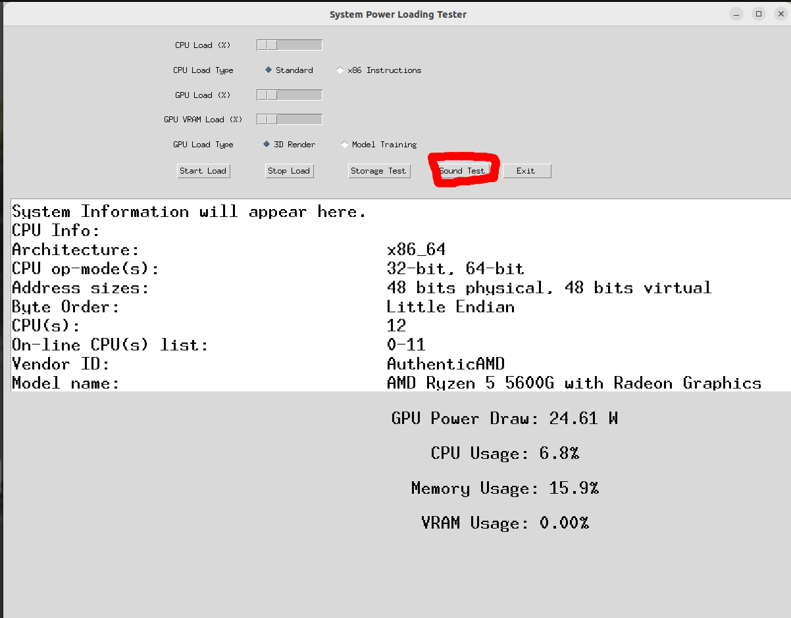
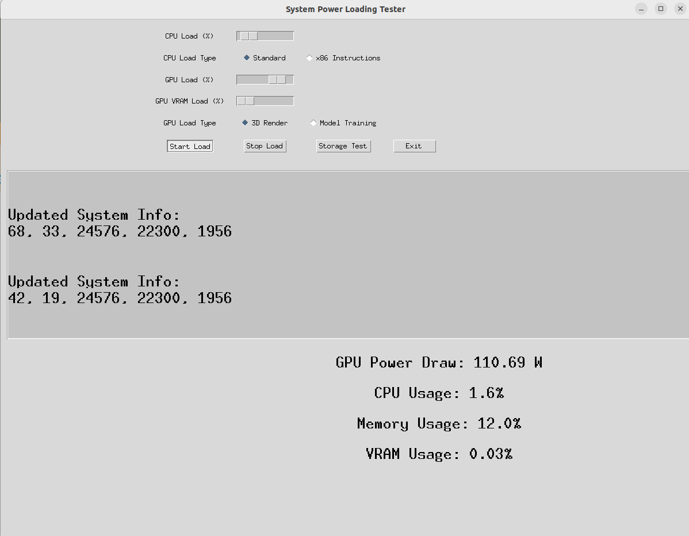
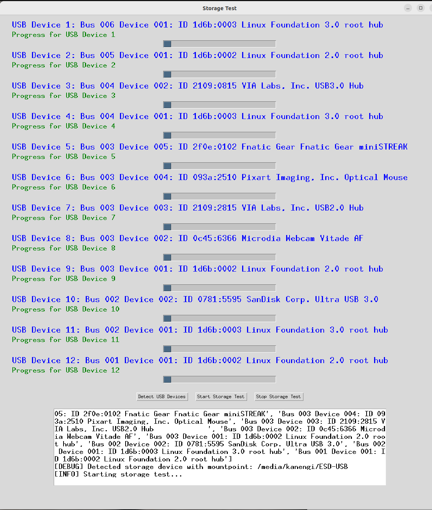

# Ubuntu_loadpower
> [!NOTE]
> Update！ ver 0.14(0.1 is initial release)
> Implemented USB device test (storage test) mode
> CPU loading test is revised to test multi function
> This update improved GPU/VRAM test function

## Updated and added (21th Feb 2025)
- Adding the script "noisetester.py" from soundtester repository

https://github.com/mi-kaneyon/soundtester



## Updated and added (11th Mar 2025)
- revised soundtest routine
- storage 

## Updated and added (29th Jan 2025)
- Replacing the script "gpu_load.py"
- Improved VRAM loading test with GPU loading test combination
- bug fix shut down the script due to the exception code


## Updated and added (28th Nov)
- main.py codes
- 3D GPU test texture is renewed
- create_directory.sh
- storage_test.py
- cpu_load.py is replaced x86 test type and bug fix


> [!NOTE]
> Load power will be updated system test suits such as package software.

- CUDA based(GPU)
- **New** VRAM Usage 
- CPU x86 based---> binary changed
- avoiding shutdown
## Overview
Ubuntu_loadpower is a tool designed to stress test the system's CPU and GPU on Ubuntu. It provides a graphical interface to apply different levels of load to the CPU and GPU, allowing users to monitor the system's power consumption and performance under stress.

## updated
- multi GPU/CPU usage

> [!NOTE]
> If you need to simple check, access this repository

https://github.com/mi-kaneyon/simple_stresschecker


## Features
- CPU load test using matrix multiplication for maximum stress.
- GPU load test with options for 3D rendering and machine learning model training.
- Real-time system information display, including CPU and GPU usage and power consumption.
- Easy-to-use graphical interface with load control sliders.

## System Components
- **main.py**: Main GUI application script.
- **cpu_load/cpu_load.py**: Script for applying load to the CPU.
- **gpu_load/gpu_load.py**: Script for applying load to the GPU.
- **system_info/system_info.py**: Script for retrieving system information.

## Directory Structure

```

Ubuntu_loadpower/
├── cpu_load/
│ └── cpu_load.py
├── gpu_load/
│ └── gpu_load.py
├── system_info/
│ └── system_info.py
├── main.py
├── create_directories.sh
│
└── requirements.txt

```

## Setup and Installation

1. **Clone the repository:**
 
   ```
   git clone https://github.com/mi-kaneyon/Ubuntu_loadpower.git

   cd Ubuntu_loadpower
   ```
  
2. Install the required Python packages:

  ```sh
  pip install -r requirements.txt

  ```
3. Create the directory structure:
 
```sh
chmod +x create_directory.sh 
./create_directory.sh
```

4. Place the respective script files in the appropriate directories:

    - Place main.py in the Ubuntu_loadpower directory.
    - Place cpu_load.py in the Ubuntu_loadpower/cpu_load directory.
    - Place gpu_load.py in the Ubuntu_loadpower/gpu_load directory.
    - Place system_info.py in the Ubuntu_loadpower/system_info directory. 


```
python main.py
```

# GUI instruction 

- The "System power loading Tester" application provides a graphical interface for applying load to the CPU and GPU and monitoring system information. Below is a description of the interface and its controls:

### Interface Overview


### Controls

1. **CPU Load (%)**
   - **Slider**: Adjusts the percentage of load to apply to the CPU. 
   - **Label**: Displays the current load percentage.

2. **GPU Load (%)**
   - **Slider**: Adjusts the percentage of load to apply to the GPU.
   - **Label**: Displays the current load percentage.

3. **GPU Load Type**
   - **3D Rendering**: Select this option to apply a load using 3D rendering tasks.
   - **Model Training**: Select this option to apply a load using machine learning model training tasks.

4. **Apply Load**
   - **Button**: Starts applying the specified load to the CPU and GPU based on the slider values and selected GPU load type.

5. **Stop Load**
   - **Button**: Stops the load tests and resets the load values to 0%.

6. **Exit**
   - **Button**: Closes the application.

### Information Display

- **CPU Information**
  - Displays detailed information about the CPU, such as architecture, op-modes, address sizes, vendor ID, model name, etc.

- **Real-time System Information**
  - **CPU Usage**: Shows the current CPU usage percentage.
  - **Memory Usage**: Shows the current memory usage percentage.
  - **GPU Power Draw**: Shows the current power draw of the GPU in watts.

### Usage Steps

1. **Adjust CPU and GPU Load**: Use the sliders to set the desired load percentage for the CPU and GPU.
2. **Select GPU Load Type**: Choose either "3D Rendering" or "Model Training" for the GPU load type.
3. **Apply Load**: Click the "Apply Load" button to start the load tests.
4. **Monitor System Information**: Observe the real-time updates in the information display section.
5. **Stop Load**: Click the "Stop Load" button to stop the load tests and reset the load values.
6. **Exit Application**: Click the "Exit" button to close the application.

By following these steps, you can effectively use the "System power loading Tester" application to stress test your system and monitor its performance under load.


# Option -- 2D/3D benchmark

```
python grapshtest.py
```

- Preparing texture.jpg for 2D bench
- 3D image is not necessary (script itself genrate figure)

# storage test view



  
# New Project (proto type)
## USB port access bench 

command line

```
python storage.py 
```

### sample result


```
python storage.py 
Testing storage device mounted at: /media/manyan3/EA42-CF3C
Testing non-storage device: Bus 002 Device 001: ID 1d6b:0003 Linux Foundation 3.0 root hub
Testing non-storage device: Bus 001 Device 005: ID 0930:6544 Toshiba Corp. TransMemory-Mini / Kingston DataTraveler 2.0 Stick
Testing non-storage device: Bus 001 Device 003: ID 5986:211b Acer, Inc HD Webcam
Testing non-storage device: Bus 001 Device 004: ID 8087:0026 Intel Corp. AX201 Bluetooth
Testing non-storage device: Bus 001 Device 002: ID 04d9:a31c Holtek Semiconductor, Inc. USB Gaming Mouse
Testing non-storage device: Bus 001 Device 001: ID 1d6b:0002 Linux Foundation 2.0 root hub
Couldn't open device, some information will be missing
Couldn't open device, some information will be missing
Couldn't open device, some information will be missing
Couldn't open device, some information will be missing
Couldn't open device, some information will be missing
Couldn't open device, some information will be missing
                                                                                
Summary for /media/manyan3/EA42-CF3C: 252 successes, 0 failures<00:14,  1.05s/s]
Non-Storage Test on 0930:6544:  95%|██████████▍| 286/300 [04:59<00:14,  1.05s/s]
Summary for 8087:0026: 286 successes, 0 failures 286/300 [04:59<00:14,  1.05s/s]
USB Info:ge Test on 8087:0026:  95%|██████████▍| 286/300 [04:59<00:14,  1.05s/s]
  bcdUSB               2.011c:  95%|██████████▍| 286/300 [04:59<00:14,  1.05s/s]
  bDeviceClass          224 Wireless                                            
  iProduct                0 


Summary for 1d6b:0003: 286 successes, 0 failures                                
USB Info:
  bcdUSB               3.10
  bDeviceClass            9 Hub
  iProduct                2 xHCI Host Controller


Summary for 04d9:a31c: 286 successes, 0 failures
USB Info:
  bcdUSB               2.00
  bDeviceClass            0 
  iProduct                2 USB Gaming Mouse                                    


Summary for 1d6b:0002: 286 successes, 0 failures
USB Info:
  bcdUSB               2.00
  bDeviceClass            9 Hub
  iProduct                2 xHCI Host Controller
                                                                                

Summary for 0930:6544: 286 successes, 0 failures
USB Info:                                                                       
  bcdUSB               2.00
  bDeviceClass            0 
  iProduct                2 TransMemory


Summary for 5986:211b: 286 successes, 0 failures
USB Info:
  bcdUSB               2.01                                                     
  bDeviceClass          239 Miscellaneous Device
  iProduct                2 HD Webcam


```


