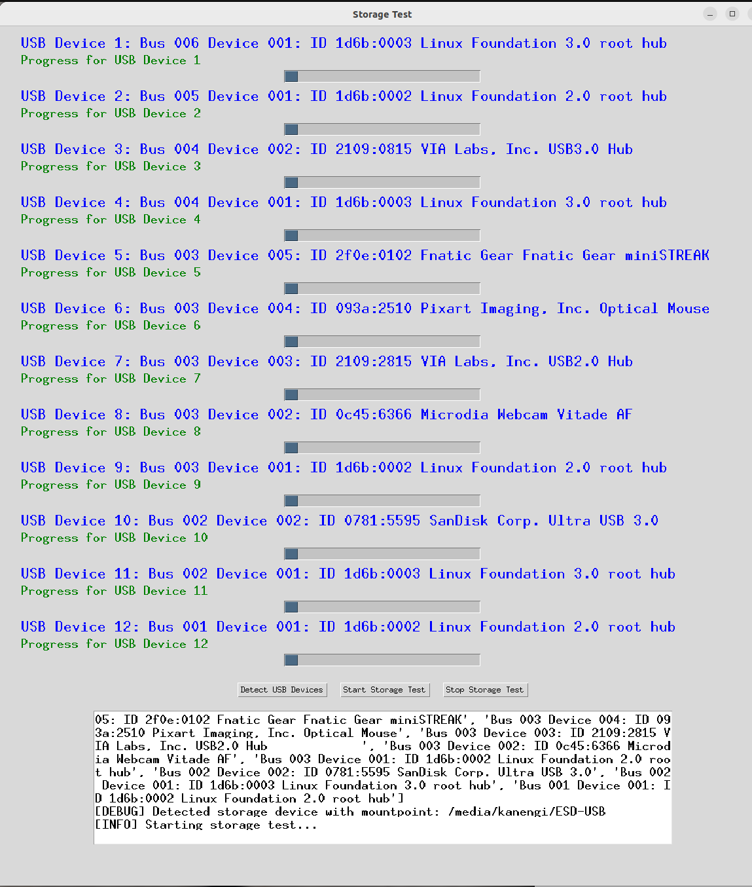

# Ubuntu_loadpower

> [!注意]
> 更新！版本 0.11 (0.1 为初始发布)
> 实现了 USB 设备测试（存储测试）模式

## 更新和新增内容（11月18日）
- main.py 代码
- 3D GPU 测试的纹理已更新
- create_directory.sh
- storage_test.py

> [!注意]
> Load power 将会更新系统测试套件，例如软件包测试。

- 基于 CUDA 的 (GPU)
- **新增** VRAM 使用
- 基于 x86 的 CPU
- 避免系统关闭

## 概述
Ubuntu_loadpower 是一款设计用于在 Ubuntu 系统中对 CPU 和 GPU 进行压力测试的工具。它提供了图形界面，用户可以为 CPU 和 GPU 施加不同级别的负载，并监控系统在压力下的功耗和性能。

## 更新内容
- 多 GPU/CPU 使用支持

> [!注意]
> 如果您需要简单的测试，请访问此存储库：

https://github.com/mi-kaneyon/simple_stresschecker

## 功能
- 使用矩阵乘法的 CPU 负载测试，以达到最大压力。
- GPU 负载测试，可选择 3D 渲染和机器学习模型训练任务。
- 实时显示系统信息，包括 CPU 和 GPU 使用率及功耗。
- 易于使用的图形界面，带有负载控制滑块。

## 系统组件
- **main.py**：主 GUI 应用程序脚本。
- **cpu_load/cpu_load.py**：用于对 CPU 施加负载的脚本。
- **gpu_load/gpu_load.py**：用于对 GPU 施加负载的脚本。
- **system_info/system_info.py**：用于获取系统信息的脚本。

## 目录结构

```
Ubuntu_loadpower/
├── cpu_load/
│ └── cpu_load.py
├── gpu_load/
│ └── gpu_load.py
├── system_info/
│ └── system_info.py
├── main.py
├── create_directories.sh
│
└── requirements.txt
```

## 设置与安装

1. **克隆存储库：**

   ```
   git clone https://github.com/mi-kaneyon/Ubuntu_loadpower.git

   cd Ubuntu_loadpower
   ```
  
2. 安装所需的 Python 包：

  ```sh
  pip install -r requirements.txt
  ```
  
3. 创建目录结构：

```sh
chmod +x create_directory.sh
./create_directory.sh
```

4. 将相关脚本文件放入相应目录：

    - 将 main.py 放入 Ubuntu_loadpower 目录。
    - 将 cpu_load.py 放入 Ubuntu_loadpower/cpu_load 目录。
    - 将 gpu_load.py 放入 Ubuntu_loadpower/gpu_load 目录。
    - 将 system_info.py 放入 Ubuntu_loadpower/system_info 目录。

然后运行：

```
python main.py
```

# GUI 使用说明

- "系统功率负载测试器" 应用程序提供了一个图形界面，可用于对 CPU 和 GPU 施加负载并监控系统信息。以下是界面和其控件的说明：

### 界面概述


### 控件说明

1. **CPU 负载 (%)**
   - **滑块**：调整对 CPU 施加的负载百分比。
   - **标签**：显示当前的负载百分比。

2. **GPU 负载 (%)**
   - **滑块**：调整对 GPU 施加的负载百分比。
   - **标签**：显示当前的负载百分比。

3. **GPU 负载类型**
   - **3D 渲染**：选择此选项以通过 3D 渲染任务施加负载。
   - **模型训练**：选择此选项以通过机器学习模型训练任务施加负载。

4. **应用负载**
   - **按钮**：根据滑块的值和选择的 GPU 负载类型，开始对 CPU 和 GPU 施加负载。

5. **停止负载**
   - **按钮**：停止负载测试并将负载值重置为 0%。

6. **退出**
   - **按钮**：关闭应用程序。

### 信息显示

- **CPU 信息**
  - 显示 CPU 的详细信息，例如架构、操作模式、地址大小、厂商 ID、型号名称等。

- **实时系统信息**
  - **CPU 使用率**：显示当前 CPU 使用百分比。
  - **内存使用率**：显示当前内存使用百分比。
  - **GPU 功率消耗**：显示 GPU 当前的功耗（单位：瓦）。

### 使用步骤

1. **调整 CPU 和 GPU 负载**：使用滑块设置 CPU 和 GPU 的目标负载百分比。
2. **选择 GPU 负载类型**：选择 "3D 渲染" 或 "模型训练" 来确定 GPU 的负载类型。
3. **应用负载**：点击 "应用负载" 按钮，开始负载测试。
4. **监控系统信息**：观察信息显示部分的实时更新。
5. **停止负载**：点击 "停止负载" 按钮，停止负载测试并重置负载值。
6. **退出应用程序**：点击 "退出" 按钮关闭应用程序。

通过以上步骤，您可以有效地使用 "系统功率负载测试器" 应用程序对系统进行压力测试，并在负载下监控系统的性能。

# 选项 -- 2D/3D 基准测试

```
python grapshtest.py
```

- 准备好 texture.jpg 进行 2D 基准测试
- 3D 图像不需要（脚本会自动生成图形）

# 存储测试界面



# 新项目（原型）
## USB 端口访问测试

命令行：

```
python storage.py
```

### 示例结果

```
python storage.py
Testing storage device mounted at: /media/manyan3/EA42-CF3C
Testing non-storage device: Bus 002 Device 001: ID 1d6b:0003 Linux Foundation 3.0 root hub
Testing non-storage device: Bus 001 Device 005: ID 0930:6544 Toshiba Corp. TransMemory-Mini / Kingston DataTraveler 2.0 Stick
Testing non-storage device: Bus 001 Device 003: ID 5986:211b Acer, Inc HD Webcam
Testing non-storage device: Bus 001 Device 004: ID 8087:0026 Intel Corp. AX201 Bluetooth
Testing non-storage device: Bus 001 Device 002: ID 04d9:a31c Holtek Semiconductor, Inc. USB Gaming Mouse
Testing non-storage device: Bus 001 Device 001: ID 1d6b:0002 Linux Foundation 2.0 root hub
Couldn't open device, some information will be missing
Couldn't open device, some information will be missing
Couldn't open device, some information will be missing
Couldn't open device, some information will be missing
Couldn't open device, some information will be missing
Couldn't open device, some information will be missing
                                                                                 
Summary for /media/manyan3/EA42-CF3C: 252 successes, 0 failures<00:14,  1.05s/s]
Non-Storage Test on 0930:6544:  95%|██████████▍| 286/300 [04:59<00:14,  1.05s/s]
Summary for 8087:0026: 286 successes, 0 failures 286/300 [04:59<00:14,  1.05s/s]
USB Info:ge Test on 8087:0026:  95%|██████████▍| 286/300 [04:59<00:14,  1.05s/s]
  bcdUSB               2.011c:  95%|██████████▍| 286/300 [04:59<00:14,  1.05s/s]
  bDeviceClass          224 Wireless                                             
  iProduct                0


Summary for 1d6b:0003: 286 successes, 0 failures                                
USB Info:
  bcdUSB               3.10
  bDeviceClass            9 Hub
  iProduct                2 xHCI Host Controller


Summary for 04d9:a31c: 286 successes, 0 failures
USB Info:
  bcdUSB               2.00
  bDeviceClass            0
  iProduct                2 USB Gaming Mouse                                    


Summary for 1d6b:0002: 286 successes, 0 failures
USB Info:
  bcdUSB               2.00
  bDeviceClass            9 Hub
  iProduct                2 xHCI Host Controller
                                                                                 

Summary for 0930:6544: 286 successes, 0 failures
USB Info:                                                                       
  bcdUSB               2.00
  bDeviceClass            0
  iProduct                2 TransMemory


Summary for 5986:211b: 286 successes, 0 failures
USB Info:
  bcdUSB               2.01                                                     
  bDeviceClass          239 Miscellaneous Device
  iProduct                2 HD Webcam
```

